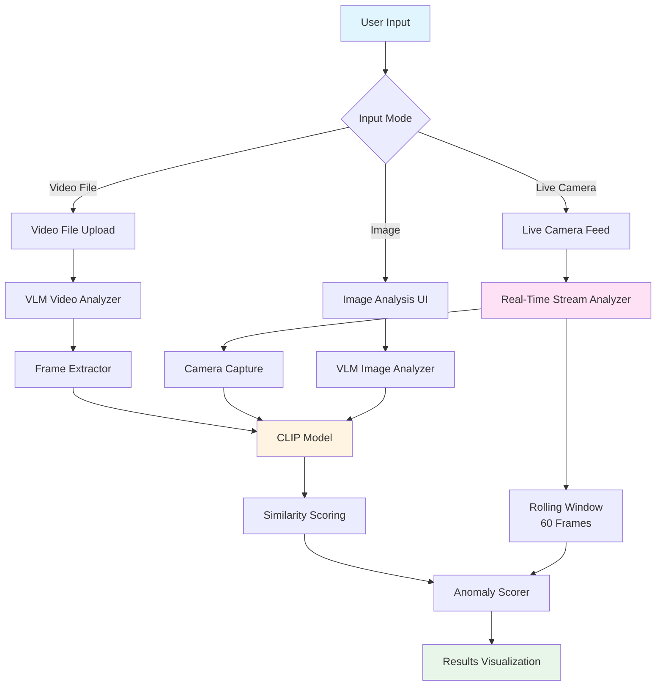
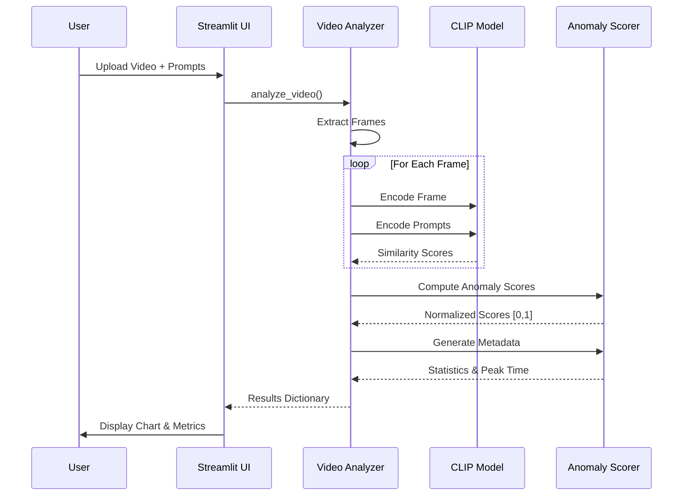

# VLM-Powered Zero-Shot Anomaly Detection

[](https://www.python.org/downloads/)
[](LICENSE)
[](https://streamlit.io/)
[](https://pytorch.org/)
[](PROJECT_STATUS.md)

> **A production-ready Vision-Language Model (VLM) system for zero-shot anomaly detection in images and videos using CLIP-based similarity scoring.**

##  Table of Contents

- [Overview](#-overview)
- [Features](#-features)
- [Architecture](#-architecture)
- [Installation](#-installation)
- [Quick Start](#-quick-start)
- [Usage](#-usage)
- [Project Structure](#-project-structure)
- [API Documentation](#-api-documentation)
- [Testing](#-testing)
- [Contributing](#-contributing)
- [License](#-license)

##  Overview

This project implements a zero-shot anomaly detection system leveraging Vision-Language Models (VLMs) to identify anomalous events in images and videos without requiring training data. The system uses OpenAI's CLIP model to compute semantic similarity between visual content and natural language descriptions of normal and anomalous conditions.

### Key Capabilities

- **Zero-Shot Detection**: No training required—define anomalies using natural language
- **Multi-Modal Analysis**: Supports both static images and video sequences
- **Real-Time Processing**: Efficient frame sampling and model caching for performance
- **Live Camera Feed**: Real-time anomaly detection from webcam with continuous monitoring
- **Dual Input Modes**: Choose between video file upload or live camera streaming
- **Interactive UI**: Streamlit-based web interface with side-by-side live feed and results
- **Flexible Configuration**: Adjustable sampling rates and customizable prompts

##  Features

### Image Analysis
-  Single-image anomaly detection
-  Real-time similarity scoring
-  Binary classification (Normal/Anomaly)
-  Detailed similarity metrics

### Video Analysis
-  Frame-by-frame processing with configurable sampling
-  Time-series anomaly score visualization
-  Automatic peak anomaly detection
-  Comprehensive metadata and statistics
-  Interactive line charts and data tables

### Live Camera Feed
-  Real-time webcam streaming with continuous anomaly detection
-  Side-by-side layout: live camera feed and results visualization
-  Rolling window of last 60 scored frames for trend analysis
-  Real-time metrics and status updates
-  Optimized performance with frame buffering and UI update throttling
-  Start/Stop controls for flexible monitoring

### Technical Features
-  Model caching for improved performance
-  GPU acceleration support (CUDA)
-  Multiple video format support (MP4, MOV, AVI, MKV, WebM)
-  Real-time frame processing with optimized buffering
-  UI update throttling for smooth live feed performance
-  Error handling and validation
-  Progress tracking and status updates

##  Architecture

### System Architecture



### Processing Pipeline



### Component Diagram

```
┌─────────────────────────────────────────────────────────────┐
│                    Streamlit UI Layer                        │
├──────────────────────────────────────────────────────────────┤
│   app.py (Unified Interface)                                │
│   ├── Video File Upload Mode                                │
│   └── Live Camera Feed Mode                                 │
│                                                              │
│   app_video.py (Legacy - Video Analysis)                   │
└──────────┬──────────────────────────────┬────────────────────┘
           │                              │
           ▼                              ▼
┌─────────────────────────────────────────────────────────────┐
│                    ML Core Layer                            │
├──────────────────┬──────────────────┬───────────────────────┤
│  vlm_test.py     │ video_analyzer.py│  anomaly_scorer.py    │
│  (CLIP Model)    │ (Video Pipeline) │ (Scoring Algorithm)   │
│                  │                  │ (Rolling Window)      │
└──────────────────┴──────────────────┴───────────────────────┘
           │                          │              │
           └──────────┬───────────────┴──────────────┘
                      ▼
           ┌──────────────────────┐
           │   CLIP Model (ViT)   │
           │  (open-clip-torch)   │
           │   ViT-B-16           │
           └──────────────────────┘
```

## Installation

### Prerequisites

- Python 3.8 or higher
- pip package manager
- (Optional) CUDA-capable GPU for faster processing

### Step 1: Clone the Repository

```bash
git clone https://github.com/Seif-rashwan/VLM-Anomaly-Detection--.git
cd VLM-Anomaly-Detection--
```

### Step 2: Create Virtual Environment (Recommended)

```bash
# Using venv
python -m venv venv

# Activate virtual environment
# On Windows:
venv\Scripts\activate
# On macOS/Linux:
source venv/bin/activate
```

### Step 3: Install Dependencies

```bash
pip install -r requirements.txt
```

### Step 4: Verify Installation

```bash
python -c "import torch; import open_clip; print('Installation successful!')"
```

##  Quick Start

### Unified Video Anomaly Detection Interface

1. **Launch the Main Application:**
   ```bash
   streamlit run ui/app.py
   ```

2. **Choose Input Mode:**
   - **Video File Upload**: Upload and analyze pre-recorded videos
   - **Live Camera Feed**: Real-time anomaly detection from webcam

3. **For Video File Upload:**
   - Upload a video file (MP4, MOV, AVI, etc.)
   - Enter normal and anomaly prompts
   - Adjust sampling rate (frames per second)
   - Click "🚨 Start Anomaly Analysis"
   - View time-series chart and anomaly detection results

4. **For Live Camera Feed:**
   - Allow camera access when prompted
   - Enter normal and anomaly prompts
   - Adjust sampling rate (frames per second)
   - Click "▶️ Start Live Monitoring"
   - View live camera feed alongside real-time anomaly scores and charts
   - Click "⏹️ Stop Live Monitoring" to end the stream

### Image Analysis (Legacy)

1. **Launch the Image Analysis Interface:**
   ```bash
   streamlit run ui/app.py
   ```
   *Note: The main app now focuses on video analysis. For image-only analysis, use the programmatic API.*

##  Usage

### Programmatic API

#### Image Analysis

```python
from ml_core.vlm_test import analyze_image_vlm
from PIL import Image

# Load image
image = Image.open("path/to/image.jpg")

# Analyze
results = analyze_image_vlm(
    image=image,
    normal_prompt="A person walking normally",
    anomaly_prompt="A person falling down"
)

print(f"Normal similarity: {results['normal']:.4f}")
print(f"Anomaly similarity: {results['anomaly']:.4f}")
```

#### Video Analysis

```python
from ml_core.video_analyzer import analyze_video

# Analyze video file
results = analyze_video(
    video_path="path/to/video.mp4",
    prompt_normal="A person walking normally",
    prompt_anomaly="A person falling down",
    sampling_rate_fps=1.0  # Process 1 frame per second
)

if results["status"] == "Success":
    # Access time-series data
    for data_point in results["data"]:
        print(f"Time: {data_point['time_s']}s, Score: {data_point['score']:.3f}")
    
    # Access metadata
    metadata = results["metadata"]
    print(f"Peak anomaly at: {metadata['max_anomaly_time']:.1f}s")
    print(f"Max score: {metadata['max_anomaly_score']:.3f}")
```

#### Real-Time Camera Stream

```python
from ui.app import analyze_realtime_stream

# Start real-time monitoring (runs in Streamlit context)
analyze_realtime_stream(
    camera_index=0,  # Camera device index (0 for default webcam)
    prompt_normal="A person walking normally",
    prompt_anomaly="A person falling down",
    sampling_rate_fps=1.0  # Process 1 frame per second
)

# Note: This function is designed to run within Streamlit's execution context.
# For standalone usage, use the Streamlit UI or adapt the function for your needs.
```

### Command-Line Testing

```bash
# Test image analysis
python ml_core/vlm_test.py

# Expected output:
# --- VLM Prototype Results ---
# Similarity to 'Dog walking peacefully': 0.2753
# Similarity to 'A heavily damaged car after a crash.': 0.0408
```

##  Project Structure

```
VLM-Anomaly-Detection--/
│
├── ml_core/                      # Machine Learning Core Components
│   ├── vlm_test.py              # CLIP model wrapper and image analysis
│   ├── video_analyzer.py        # Video processing pipeline
│   ├── anomaly_scorer.py        # Anomaly scoring algorithms
│   ├── video_processor.py       # Frame extraction utilities
│   └── ml_api_handler.py        # API handler (if applicable)
│
├── ui/                           # User Interface Components
│   ├── app.py                   # Unified video analysis app (File Upload + Live Camera)
│   ├── app_video.py             # Legacy video analysis Streamlit app
│   └── ui_visuals.py            # Visualization utilities
│
├── data/                         # Test Data
│   ├── test_image.jpg           # Sample image for testing
│   └── test_video.mp4           # Sample video for testing
│
├── documentation/                # Documentation
│   └── api_spec.md              # API specification
│
├── .streamlit/                   # Streamlit Configuration
│   └── config.toml              # Streamlit settings
│
├── requirements.txt              # Python dependencies
├── LICENSE                       # MIT License
├── README.md                     # This file
├── DELIVERABLES_CHECKLIST.md    # Project deliverables
├── PROJECT_STATUS.md            # Project status report
└── TESTING_GUIDE.md             # Testing instructions
```

##  API Documentation

### Core Functions

#### `analyze_image_vlm(image, normal_prompt, anomaly_prompt)`

Analyzes a single image using CLIP to compute similarity scores.

**Parameters:**
- `image` (Union[str, Image.Image]): Image file path or PIL Image object
- `normal_prompt` (str): Text description of normal condition
- `anomaly_prompt` (str): Text description of anomaly condition

**Returns:**
- `Dict[str, float]`: Dictionary with keys `'normal'` and `'anomaly'` containing similarity scores

**Example:**
```python
results = analyze_image_vlm(
    image="data/test_image.jpg",
    normal_prompt="Dog walking peacefully",
    anomaly_prompt="A heavily damaged car after a crash."
)
```

#### `analyze_video(video_path, prompt_normal, prompt_anomaly, sampling_rate_fps=1.0)`

Analyzes a video file frame-by-frame and returns time-series anomaly scores.

**Parameters:**
- `video_path` (str): Path to video file
- `prompt_normal` (str): Text description of normal condition
- `prompt_anomaly` (str): Text description of anomaly condition
- `sampling_rate_fps` (float): Frames per second to sample (default: 1.0)

**Returns:**
- `Dict`: Dictionary with structure:
  ```python
  {
      "status": "Success" | "Error",
      "data": [
          {"time_s": float, "score": float},  # Time-series data
          ...
      ],
      "metadata": {
          "total_frames": int,
          "total_seconds": float,
          "max_anomaly_score": float,
          "max_anomaly_time": float,
          "average_score": float,
          ...
      }
  }
  ```

**Example:**
```python
results = analyze_video(
    video_path="data/test_video.mp4",
    prompt_normal="A person walking normally",
    prompt_anomaly="A person falling down",
    sampling_rate_fps=1.0
)
```

#### `analyze_realtime_stream(camera_index, prompt_normal, prompt_anomaly, sampling_rate_fps=1.0)`

Analyzes frames from a live camera feed in real-time and updates Streamlit UI with continuous anomaly scores.

**Parameters:**
- `camera_index` (int): Camera device index (0 for default webcam)
- `prompt_normal` (str): Text description of normal condition
- `prompt_anomaly` (str): Text description of anomaly condition
- `sampling_rate_fps` (float): Frames per second to sample (default: 1.0)

**Features:**
- Maintains a rolling window of the last 60 scored frames
- Updates UI in real-time with live camera feed and anomaly scores
- Side-by-side layout: camera feed (left) and results (right)
- Optimized performance with frame buffering and UI update throttling

**Note:** This function is designed to run within Streamlit's execution context. Use the Streamlit UI to access this functionality.

### Anomaly Scoring

#### `compute_anomaly_scores(normal_similarities, anomaly_similarities)`

Converts similarity scores to normalized anomaly scores [0, 1].

**Parameters:**
- `normal_similarities` (List[float]): List of similarity scores to normal prompt
- `anomaly_similarities` (List[float]): List of similarity scores to anomaly prompt

**Returns:**
- `List[float]`: Normalized anomaly scores in [0, 1] range

##  Testing

### Running Tests

See [TESTING_GUIDE.md](TESTING_GUIDE.md) for comprehensive testing instructions.

**Quick Test:**
```bash
# Test image analysis
python ml_core/vlm_test.py

# Test video analysis (requires test video)
python -c "from ml_core.video_analyzer import analyze_video; \
    print(analyze_video('data/test_video.mp4', 'normal', 'anomaly'))"
```

### Test Coverage

-  Image analysis functionality
-  Video frame extraction
-  Anomaly scoring algorithm
-  UI components
-  Error handling
-  Edge cases

##  Configuration

### Model Configuration

The CLIP model can be configured in `ml_core/vlm_test.py`:

```python
MODEL_NAME = "ViT-B-16"  # Model architecture
PRETRAINED_WEIGHTS = "laion2b_s34b_b88k"  # Pre-trained weights
```

### Streamlit Configuration

Edit `.streamlit/config.toml` to customize Streamlit settings:

```toml
[logger]
level = "warning"

[server]
runOnSave = true
```

##  Performance Considerations

### Processing Speed

- **Image Analysis**: ~1-3 seconds per image (first run: 10-30s for model download)
- **Video Analysis**: ~1-2 seconds per second of video (at 1 fps sampling rate)
  - 10-second video: ~10-20 seconds
  - 60-second video: ~60-120 seconds
- **Live Camera Feed**: 
  - Camera feed updates smoothly (30+ fps display)
  - Model inference: ~0.5-2 seconds per frame (depending on hardware)
  - UI updates throttled to 0.5s intervals for optimal performance
  - Lower sampling rates (0.5-1.0 fps) recommended for smoother experience

### Optimization Tips

1. **Use GPU**: Automatically detected if CUDA is available (significantly faster inference)
2. **Adjust Sampling Rate**: Lower sampling rates = faster processing and smoother live feed
   - For live camera: 0.5-1.0 fps recommended
   - For video files: 1.0-2.0 fps for good balance
3. **Model Caching**: Model is cached after first load (subsequent runs are faster)
4. **Frame Buffering**: Live feed uses optimized buffer settings to minimize latency
5. **UI Update Throttling**: Heavy UI elements (charts/tables) update every 0.5s to maintain responsiveness
6. **Batch Processing**: Process multiple images/videos programmatically for efficiency


##  License

This project is licensed under the MIT License - see the [LICENSE](LICENSE) file for details.

##  Acknowledgments

- [OpenAI CLIP](https://github.com/openai/CLIP) - Vision-Language Model
- [Open CLIP](https://github.com/mlfoundations/open_clip) - Open-source CLIP implementation
- [Streamlit](https://streamlit.io/) - Web application framework
- [PyTorch](https://pytorch.org/) - Deep learning framework


