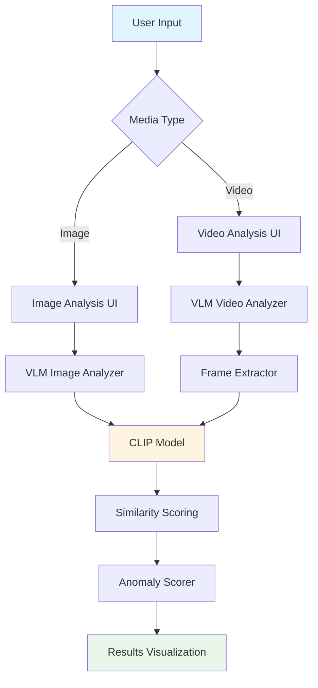
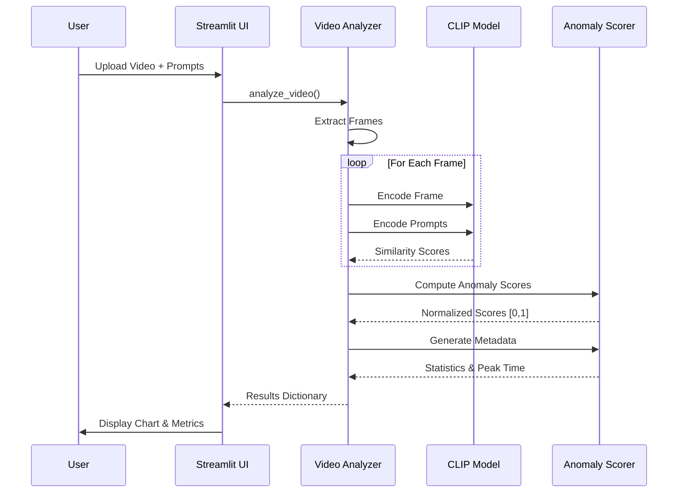

# 🔍 VLM-Powered Zero-Shot Anomaly Detection

[](https://www.python.org/downloads/)
[](LICENSE)
[](https://streamlit.io/)
[](https://pytorch.org/)
[](PROJECT_STATUS.md)

> **A production-ready Vision-Language Model (VLM) system for zero-shot anomaly detection in images and videos using CLIP-based similarity scoring.**

##  Table of Contents

- [Overview](#-overview)
- [Features](#-features)
- [Architecture](#-architecture)
- [Installation](#-installation)
- [Quick Start](#-quick-start)
- [Usage](#-usage)
- [Project Structure](#-project-structure)
- [API Documentation](#-api-documentation)
- [Testing](#-testing)
- [Contributing](#-contributing)
- [License](#-license)

## 🎯 Overview

This project implements a zero-shot anomaly detection system leveraging Vision-Language Models (VLMs) to identify anomalous events in images and videos without requiring training data. The system uses OpenAI's CLIP model to compute semantic similarity between visual content and natural language descriptions of normal and anomalous conditions.

### Key Capabilities

- **Zero-Shot Detection**: No training required—define anomalies using natural language
- **Multi-Modal Analysis**: Supports both static images and video sequences
- **Real-Time Processing**: Efficient frame sampling and model caching for performance
- **Interactive UI**: Streamlit-based web interface for easy interaction
- **Flexible Configuration**: Adjustable sampling rates and customizable prompts

## ✨ Features

### Image Analysis
- ✅ Single-image anomaly detection
- ✅ Real-time similarity scoring
- ✅ Binary classification (Normal/Anomaly)
- ✅ Detailed similarity metrics

### Video Analysis
- ✅ Frame-by-frame processing with configurable sampling
- ✅ Time-series anomaly score visualization
- ✅ Automatic peak anomaly detection
- ✅ Comprehensive metadata and statistics
- ✅ Interactive line charts and data tables

### Technical Features
- ✅ Model caching for improved performance
- ✅ GPU acceleration support (CUDA)
- ✅ Multiple video format support (MP4, MOV, AVI, MKV, WebM)
- ✅ Error handling and validation
- ✅ Progress tracking and status updates

## 🏗️ Architecture

### System Architecture



### Processing Pipeline



### Component Diagram

```
┌─────────────────────────────────────────────────────────────┐
│                    Streamlit UI Layer                        │
├──────────────────────┬──────────────────────────────────────┤
│   app.py             │         app_video.py                 │
│  (Image Analysis)    │      (Video Analysis)                │
└──────────┬───────────┴──────────────┬───────────────────────┘
           │                          │
           ▼                          ▼
┌─────────────────────────────────────────────────────────────┐
│                    ML Core Layer                            │
├──────────────────┬──────────────────┬───────────────────────┤
│  vlm_test.py     │ video_analyzer.py│  anomaly_scorer.py    │
│  (CLIP Model)    │ (Video Pipeline) │ (Scoring Algorithm)   │
└──────────────────┴──────────────────┴───────────────────────┘
           │                          │              │
           └──────────┬───────────────┴──────────────┘
                      ▼
           ┌──────────────────────┐
           │   CLIP Model (ViT)   │
           │  (open-clip-torch)   │
           └──────────────────────┘
```

## 📦 Installation

### Prerequisites

- Python 3.8 or higher
- pip package manager
- (Optional) CUDA-capable GPU for faster processing

### Step 1: Clone the Repository

```bash
git clone https://github.com/yourusername/VLM-Anomaly-Detection--.git
cd VLM-Anomaly-Detection--
```

### Step 2: Create Virtual Environment (Recommended)

```bash
# Using venv
python -m venv venv

# Activate virtual environment
# On Windows:
venv\Scripts\activate
# On macOS/Linux:
source venv/bin/activate
```

### Step 3: Install Dependencies

```bash
pip install -r requirements.txt
```

### Step 4: Verify Installation

```bash
python -c "import torch; import open_clip; print('Installation successful!')"
```

## 🚀 Quick Start

### Image Analysis

1. **Launch the Image Analysis Interface:**
   ```bash
   streamlit run ui/app.py
   ```

2. **In the browser:**
   - Upload an image file
   - Enter normal condition prompt (e.g., "Dog walking peacefully")
   - Enter anomaly condition prompt (e.g., "A heavily damaged car after a crash")
   - Click "🚨 Start Analysis"
   - View similarity scores and classification

### Video Analysis

1. **Launch the Video Analysis Interface:**
   ```bash
   streamlit run ui/app_video.py
   ```

2. **In the browser:**
   - Upload a video file (MP4, MOV, AVI, etc.)
   - Enter normal and anomaly prompts
   - Adjust sampling rate (frames per second)
   - Click "🚨 Start Anomaly Analysis"
   - View time-series chart and anomaly detection results

## 📖 Usage

### Programmatic API

#### Image Analysis

```python
from ml_core.vlm_test import analyze_image_vlm
from PIL import Image

# Load image
image = Image.open("path/to/image.jpg")

# Analyze
results = analyze_image_vlm(
    image=image,
    normal_prompt="A person walking normally",
    anomaly_prompt="A person falling down"
)

print(f"Normal similarity: {results['normal']:.4f}")
print(f"Anomaly similarity: {results['anomaly']:.4f}")
```

#### Video Analysis

```python
from ml_core.video_analyzer import analyze_video

# Analyze video
results = analyze_video(
    video_path="path/to/video.mp4",
    prompt_normal="A person walking normally",
    prompt_anomaly="A person falling down",
    sampling_rate_fps=1.0  # Process 1 frame per second
)

if results["status"] == "Success":
    # Access time-series data
    for data_point in results["data"]:
        print(f"Time: {data_point['time_s']}s, Score: {data_point['score']:.3f}")
    
    # Access metadata
    metadata = results["metadata"]
    print(f"Peak anomaly at: {metadata['max_anomaly_time']:.1f}s")
    print(f"Max score: {metadata['max_anomaly_score']:.3f}")
```

### Command-Line Testing

```bash
# Test image analysis
python ml_core/vlm_test.py

# Expected output:
# --- VLM Prototype Results ---
# Similarity to 'Dog walking peacefully': 0.2753
# Similarity to 'A heavily damaged car after a crash.': 0.0408
```

## 📁 Project Structure

```
VLM-Anomaly-Detection--/
│
├── ml_core/                      # Machine Learning Core Components
│   ├── vlm_test.py              # CLIP model wrapper and image analysis
│   ├── video_analyzer.py        # Video processing pipeline
│   ├── anomaly_scorer.py        # Anomaly scoring algorithms
│   ├── video_processor.py       # Frame extraction utilities
│   └── ml_api_handler.py        # API handler (if applicable)
│
├── ui/                           # User Interface Components
│   ├── app.py                   # Image analysis Streamlit app
│   ├── app_video.py             # Video analysis Streamlit app
│   └── ui_visuals.py            # Visualization utilities
│
├── data/                         # Test Data
│   ├── test_image.jpg           # Sample image for testing
│   └── test_video.mp4           # Sample video for testing
│
├── documentation/                # Documentation
│   └── api_spec.md              # API specification
│
├── .streamlit/                   # Streamlit Configuration
│   └── config.toml              # Streamlit settings
│
├── requirements.txt              # Python dependencies
├── LICENSE                       # MIT License
├── README.md                     # This file
├── DELIVERABLES_CHECKLIST.md    # Project deliverables
├── PROJECT_STATUS.md            # Project status report
└── TESTING_GUIDE.md             # Testing instructions
```

## 📚 API Documentation

### Core Functions

#### `analyze_image_vlm(image, normal_prompt, anomaly_prompt)`

Analyzes a single image using CLIP to compute similarity scores.

**Parameters:**
- `image` (Union[str, Image.Image]): Image file path or PIL Image object
- `normal_prompt` (str): Text description of normal condition
- `anomaly_prompt` (str): Text description of anomaly condition

**Returns:**
- `Dict[str, float]`: Dictionary with keys `'normal'` and `'anomaly'` containing similarity scores

**Example:**
```python
results = analyze_image_vlm(
    image="data/test_image.jpg",
    normal_prompt="Dog walking peacefully",
    anomaly_prompt="A heavily damaged car after a crash."
)
```

#### `analyze_video(video_path, prompt_normal, prompt_anomaly, sampling_rate_fps=1.0)`

Analyzes a video file frame-by-frame and returns time-series anomaly scores.

**Parameters:**
- `video_path` (str): Path to video file
- `prompt_normal` (str): Text description of normal condition
- `prompt_anomaly` (str): Text description of anomaly condition
- `sampling_rate_fps` (float): Frames per second to sample (default: 1.0)

**Returns:**
- `Dict`: Dictionary with structure:
  ```python
  {
      "status": "Success" | "Error",
      "data": [
          {"time_s": float, "score": float},  # Time-series data
          ...
      ],
      "metadata": {
          "total_frames": int,
          "total_seconds": float,
          "max_anomaly_score": float,
          "max_anomaly_time": float,
          "average_score": float,
          ...
      }
  }
  ```

**Example:**
```python
results = analyze_video(
    video_path="data/test_video.mp4",
    prompt_normal="A person walking normally",
    prompt_anomaly="A person falling down",
    sampling_rate_fps=1.0
)
```

### Anomaly Scoring

#### `compute_anomaly_scores(normal_similarities, anomaly_similarities)`

Converts similarity scores to normalized anomaly scores [0, 1].

**Parameters:**
- `normal_similarities` (List[float]): List of similarity scores to normal prompt
- `anomaly_similarities` (List[float]): List of similarity scores to anomaly prompt

**Returns:**
- `List[float]`: Normalized anomaly scores in [0, 1] range

## 🧪 Testing

### Running Tests

See [TESTING_GUIDE.md](TESTING_GUIDE.md) for comprehensive testing instructions.

**Quick Test:**
```bash
# Test image analysis
python ml_core/vlm_test.py

# Test video analysis (requires test video)
python -c "from ml_core.video_analyzer import analyze_video; \
    print(analyze_video('data/test_video.mp4', 'normal', 'anomaly'))"
```

### Test Coverage

- ✅ Image analysis functionality
- ✅ Video frame extraction
- ✅ Anomaly scoring algorithm
- ✅ UI components
- ✅ Error handling
- ✅ Edge cases

## 🔧 Configuration

### Model Configuration

The CLIP model can be configured in `ml_core/vlm_test.py`:

```python
MODEL_NAME = "ViT-B-16"  # Model architecture
PRETRAINED_WEIGHTS = "laion2b_s34b_b88k"  # Pre-trained weights
```

### Streamlit Configuration

Edit `.streamlit/config.toml` to customize Streamlit settings:

```toml
[logger]
level = "warning"

[server]
runOnSave = true
```

## 🚧 Performance Considerations

### Processing Speed

- **Image Analysis**: ~1-3 seconds per image (first run: 10-30s for model download)
- **Video Analysis**: ~1-2 seconds per second of video (at 1 fps sampling rate)
  - 10-second video: ~10-20 seconds
  - 60-second video: ~60-120 seconds

### Optimization Tips

1. **Use GPU**: Automatically detected if CUDA is available
2. **Adjust Sampling Rate**: Lower sampling rates = faster processing
3. **Model Caching**: Model is cached after first load
4. **Batch Processing**: Process multiple images/videos programmatically

## 🤝 Contributing

Contributions are welcome! Please follow these steps:

1. Fork the repository
2. Create a feature branch (`git checkout -b feature/AmazingFeature`)
3. Commit your changes (`git commit -m 'Add some AmazingFeature'`)
4. Push to the branch (`git push origin feature/AmazingFeature`)
5. Open a Pull Request

### Development Setup

```bash
# Clone your fork
git clone https://github.com/yourusername/VLM-Anomaly-Detection--.git
cd VLM-Anomaly-Detection--

# Create virtual environment
python -m venv venv
source venv/bin/activate  # or venv\Scripts\activate on Windows

# Install development dependencies
pip install -r requirements.txt

# Make your changes and test
streamlit run ui/app.py
```

## 📄 License

This project is licensed under the MIT License - see the [LICENSE](LICENSE) file for details.

## 🙏 Acknowledgments

- [OpenAI CLIP](https://github.com/openai/CLIP) - Vision-Language Model
- [Open CLIP](https://github.com/mlfoundations/open_clip) - Open-source CLIP implementation
- [Streamlit](https://streamlit.io/) - Web application framework
- [PyTorch](https://pytorch.org/) - Deep learning framework

## 📞 Support

For issues, questions, or contributions:
- Open an issue on [GitHub Issues](https://github.com/yourusername/VLM-Anomaly-Detection--/issues)
- Check [TESTING_GUIDE.md](TESTING_GUIDE.md) for troubleshooting
- Review [PROJECT_STATUS.md](PROJECT_STATUS.md) for project status

## 📊 Project Status

✅ **All deliverables complete** - See [PROJECT_STATUS.md](PROJECT_STATUS.md) for detailed status.

- ✅ Phase 1: Initial Prototypes
- ✅ Phase 2: Parallel Feature Development
- ✅ Phase 3: System Integration & Testing

---

**Made with ❤️ using CLIP and Streamlit**
